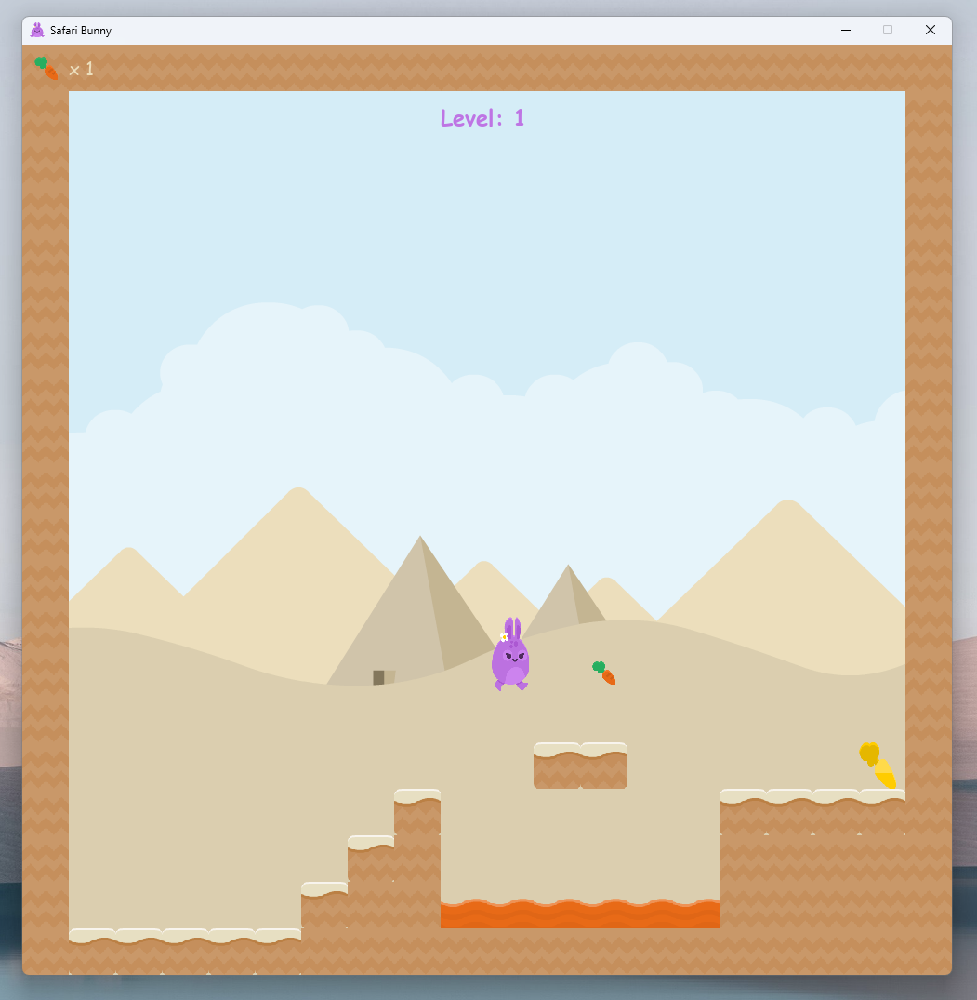

# Safari Bunny with Pygame

Safari Bunny is a platform game that consists of ten levels with different challenges. In the game, you control a purple bunny, collect points and try to pass the levels.

### Starting menu heading

- Made by me on [Photopea](https://www.photopea.com/)

### Images:
- [Kenney](https://kenney.nl/) images that are from [OpenGameArt.org](https://opengameart.org/)

### Icons:

- <a href="https://www.flaticon.com/free-icons/start" title="start icons">Start icons created by Good Ware - Flaticon</a>

- <a href="https://www.flaticon.com/free-icons/exit" title="exit icons">Exit icons created by Freepik - Flaticon</a>

- <a href="https://www.flaticon.com/free-icons/heart" title="heart icons">Heart icons created by Vectors Market - Flaticon</a>

- <a href="https://www.flaticon.com/free-icons/refresh" title="refresh icons">Refresh icons created by Freepik - Flaticon</a>

- Save button was made by me on [Photopea](https://www.photopea.com/)

- Load button was made by me on [Photopea](https://www.photopea.com/)

### Sounds:

- All sounds are from [Freesound](https://freesound.org/)

### Tutorials:

- Tutorials that were followed making this can be found here: [Coding With Russ - PyGame Tile Based Platformer Game Beginner Tutorial in Python](https://www.youtube.com/playlist?list=PLjcN1EyupaQnHM1I9SmiXfbT6aG4ezUvu)

